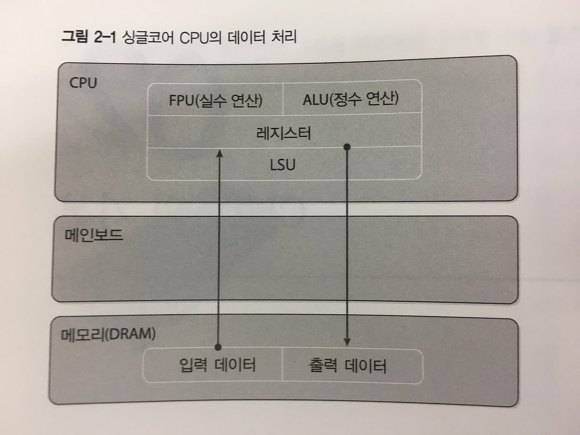
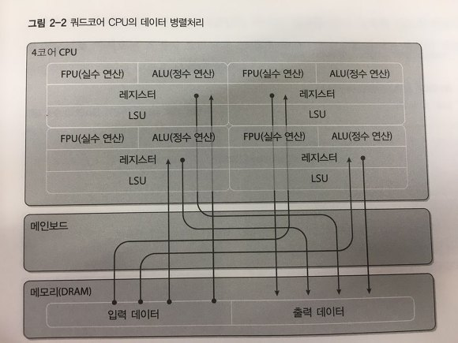
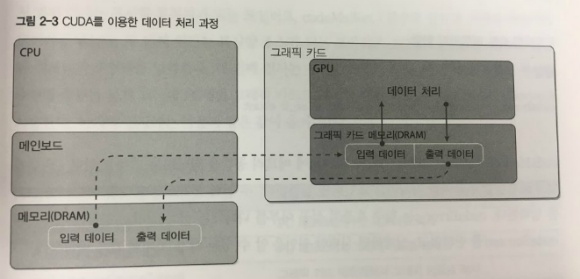

On this page, we will explore the principles of CUDA programs and parallel processing methods. Additionally, we will compare the data processing approaches of CPUs and CUDA, examine their strengths and weaknesses, and delve into the architecture of CUDA graphics cards.

## The data processing in CPU

When implementing a program in C, C++, or any other language, the computer operates as follows:

1. Allocates memory(DRAM) for input and output.
2. Inputs the data to be processed into memory.
3. Retrieves the data from memory to the CPU (registers) for operations.
4. Integer operations are handled in the ALU (Arithmetic Logic Unit), while floating-point operations are processed in the FPU (Floating-Point Unit).
5. Outputs the processed values from registers back to memory.
6. Releases the allocated memory.

<figure>
    
</figure>
<!--  -->

If the CPU consists of multiple cores and the program is implemented with four threads, it operates with the following structure:

1. Allocates memory for input and output.
2. Inputs the data to be processed into memory.
3. Divides the data into four parts to be processed by each core.
4. Processes the data with the four threads.
5. Merges the processed data.
6. Outputs the result to memory.

<figure>
    
</figure>
<!--  -->


First, the function used for parallel processing is referred to as the **Worker Function**. To implement parallel processing in a windows fashion, you create a worker function and generate threads that use this function. Represented in code, it would look like the following:

```WINAPI
#include "stdafx.h"
#include "windows.h"

DWORD WINAPI WorkerFunction (LPVOID arg)
{
    return 0;
}

int _tmain(int argc, _TCHAR* argv[])
{
    HANDLE hThreadArray[4];
    int i = 0;

    // create 4 threads.
    for (i=0; i<4; i++)
        hThreadArray[i] = CreateThread(NULL, 0, WorkerFunction, Null, 0, Null);
    
    // wait until the four threads complete their work.
    WaitForMultipleObjects(THREAD_COUNT, hThreadArray, TRUE, INFINITE);

    return 0;
}
```

## The data processing in CUDA

Because CUDA must be processed using the computing power of a superior graphics card, there are processes that need to be added to the existing CPU method. 

What is added is that input data from the PC's memory is transferred to the graphics card's memory and the results processed by the GPU are brought back to the PC's memory.

<figure>
    
</figure>

The simplified representation of CUDA data flow is as follows:

1. Allocate memory space on the graphics card.
2. Copy input data from the PC to the graphics card's memory.
3. Utilize the powerful GPU performance for parallel processing.
4. Copy the processed results from the graphics card's memory back to the PC's memory.